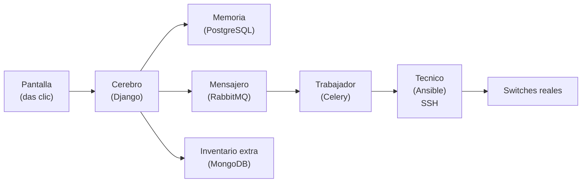
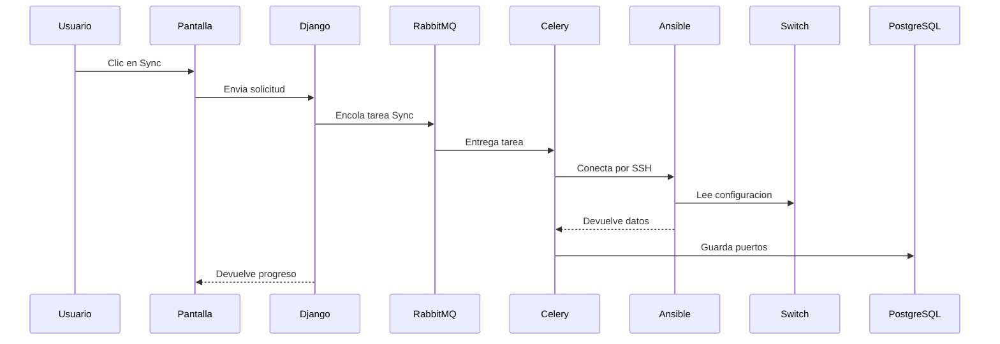

# Explicacion sencilla del sistema (para 7 anos)

Imagina que tenemos una caja magica que cuida switches (los switches son cajas que conectan cables).
Este sistema es como un equipo de ayudantes que trabajan juntos para cambiar cosas en esos switches de forma segura.

## Dibujo general (Mermaid)

## Quienes trabajan aqui (con ejemplo)

1. **La Pantalla (UI)**
   - Es la ventana donde damos clic.
   - Nos muestra los switches y los puertos.
   - Ejemplo: tu ves los botones Sync, Validar, Crear CR.

2. **El Cerebro (Django)**
   - Decide que se hace cuando damos clic.
   - Se comunica con todos los demas.
   - Ejemplo: recibe el clic de Sync y crea la tarea.

3. **La Memoria (PostgreSQL)**
   - Guarda la informacion importante.
   - Ej: switches, puertos, cambios y registros.
   - Ejemplo: guarda el resultado de un cambio.

4. **El Inventario Extra (MongoDB)**
   - Guarda datos adicionales de inventario.
   - Ejemplo: lista de equipos importados.

5. **El Mensajero (RabbitMQ)**
   - Lleva tareas al trabajador.
   - Asi la pantalla no se queda esperando.
   - Ejemplo: envia la tarea "Sync switch-10".

6. **El Trabajador (Celery)**
   - Hace las tareas pesadas en segundo plano.
   - Por ejemplo: sincronizar y validar.
   - Ejemplo: ejecuta el Sync y reporta porcentaje.

7. **El Tecnico (Ansible)**
   - Se conecta al switch por SSH.
   - Lee la configuracion y aplica cambios.
   - Ejemplo: corre "show running-config".

8. **Los Switches**
   - Son las cajas reales que vamos a configurar.
   - Ejemplo: switch-10, switch-20, switch-30.

## Como funciona paso a paso (con dibujo)

## Pasos importantes

### 1. Ver switches
La pantalla muestra los switches.
Tu eliges uno.

### 2. Sincronizar (Sync)
Cuando das clic en **Sync**:
- El mensajero (RabbitMQ) lleva la tarea.
- El trabajador (Celery) la recibe.
- El tecnico (Ansible) entra al switch y lee configuracion.
- La memoria (PostgreSQL) guarda todo.

### 3. Validar reglas
El sistema revisa los puertos con reglas:
- **MIGRAR** = si se puede cambiar.
- **EXCLUIR** = no tocar.
- **REVISAR** = mirar con cuidado.
- **YA_MIGRADO** = ya lo hizo antes el sistema.

### 4. Crear cambio (CR)
Solo los puertos **MIGRAR** quedan seleccionados.
Si quitas el chulo, ese puerto no se toca.

### 5. Aprobar y desplegar
Si apruebas:
- Ansible aplica los cambios.
- Se guarda antes y despues.
- Si falla, queda el error guardado.

## Como se conectan todos (resumen)

Pantalla -> Cerebro -> Mensajero -> Trabajador -> Tecnico -> Switch
                  -> Memoria

## Por que usamos cola de tareas
Porque algunas tareas tardan.
Asi la pantalla no se queda bloqueada.
La pantalla solo muestra el progreso (%).

## Resumen muy corto

- **Pantalla**: donde das clic.
- **Cerebro**: decide que hacer.
- **Memoria**: guarda todo.
- **Mensajero**: envia tareas.
- **Trabajador**: las hace.
- **Tecnico**: entra al switch.
- **Switch**: recibe cambios.

## Prompt para futuros despliegues (IA)

Usa este texto como guia cuando una IA deba desplegar o modificar este sistema:

1. El proyecto es Django y esta en `switches cisco/netauto`.
2. Los servicios se levantan con `docker compose up -d`.
3. Los switches se sincronizan con Ansible via SSH.
4. Las tareas largas (sync/validar/desplegar) se ejecutan en background con Celery.
5. RabbitMQ es la cola de tareas.
6. La UI no debe bloquearse; siempre usar jobs y polling.
7. La validacion se basa en reglas y solo MIGRAR crea cambios.
8. Si un puerto ya fue cambiado por el sistema, debe marcarse como YA_MIGRADO.
9. Los cambios deben guardarse en PostgreSQL y tener historial.
10. La UI debe ser moderna y responsiva.

Si hay que actualizar o agregar switches:
- editar inventario Ansible
- actualizar base de datos
- reiniciar contenedores si hace falta
                                                                                                                                                                                                                                                                                                                                                                                                                                                                                                                                                                                                                                                                                                                                                                                                                                                                                                                                                                                                                                                                                                                                                                                                                                las                                                                                                                                                                                                                                                                                                                                                                                                                                                                                                                                                                                                                                                                                                                                                                                                                                                                                                                                                                                                                                                                                                                                                                                                                                                                                                                                                                                                                                                                                                        |                                                                                                                                                                                                                          .·

                                                                                                                                                                                                                                                                                                                                                                                                                                                                                                                                                                                                                                                                                                                                                                                                                                                                                                                                                                                                                                                                                                                                                                                                                                                                                                                                                                                                                                                                                                                                                                                                                                                                                                                                                                                                                                                                                                                                                                                                                                                                                                                                                                                                                                                                                                                                                                                                                                                                                                                                                                                                                                                                                                                                       }}}

