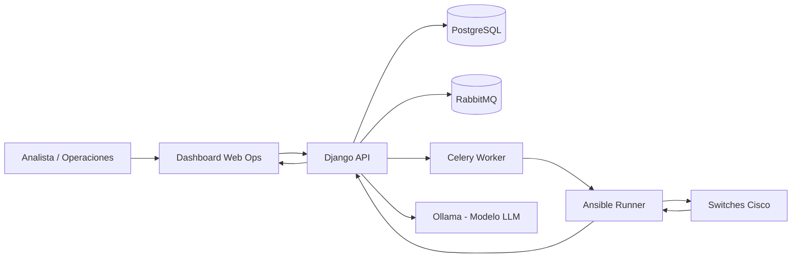

# Mapa Ejecutivo de la Aplicacion NetAuto

Este documento resume como funciona la plataforma para una audiencia directiva.

## 1) Que resuelve

- Centraliza el cambio de puertos en switches Cisco.
- Aplica reglas de control (802.1X) antes de tocar red productiva.
- Permite dos modos de autorizacion: Analista o IA.
- Deja trazabilidad completa: quien autorizo, que se cambio, cuando, y con que resultado.

## 2) Mapa de alto nivel (arquitectura)

## 3) Flujo de negocio (de punta a punta)

1. **Descubrimiento**: se sincronizan puertos desde el switch.
2. **Validacion**: se clasifican puertos (MIGRAR, EXCLUIR, REVISAR, YA_MIGRADO).
3. **Change Request (CR)**: se crea una propuesta formal de cambio.
4. **Autorizacion**:
   - Manual por analista, o
   - Automatica por IA (con razon y trazas).
5. **Decision operativa**:
   - Si aplica, se despliega en el switch.
   - Si no aplica por politica, se marca como `no_migrar` (no es falla tecnica).
6. **Evidencia**: se guarda diff, snapshots, logs, actor y resultado.

## 4) Donde entra la IA

- Evalua el CR antes del despliegue.
- Devuelve veredicto (`approve/reject`) y razon.
- Registra telemetria: tokens, latencia, eventos de ejecucion.
- El dashboard muestra estado de ejecucion y resultados para seguimiento operativo.

## 5) Control y gobierno (lo que ve direccion)

- **Seguridad**: reglas de exclusion para puertos criticos (ej. gestion, trunk, VLANs restringidas).
- **Riesgo**: si hay duda o inconsistencia, la IA rechaza.
- **Auditoria**: cada CR deja historial completo (actor, hora, cambios, resultado).
- **Operacion**: ejecucion asincrona con progreso y estado final.

## 6) KPI sugeridos para tablero directivo

- CRs procesados por periodo.
- % aprobados vs % rechazados.
- % despliegues exitosos.
- Tiempo promedio de autorizacion IA.
- Tiempo promedio de despliegue.
- Interfaces migradas por sede/dispositivo.
- Top causas de rechazo.

## 7) Endpoints clave (referencia rapida)

- Dashboard IA: `GET /audit/ai-dashboard/`
- Ultima ejecucion IA (formato envelope): `GET /audit/jobs/`
- Estado de tarea async: `GET /audit/jobs/<task_id>/`
- IA por CR: `POST /audit/change-requests/<id>/ai-approve-deploy/`
- IA batch async: `POST /audit/change-requests/ai-approve-deploy/async/`
- Resultado CR: `GET /audit/change-requests/<id>/results/`

## 8) Mensaje ejecutivo (1 minuto)

NetAuto reduce riesgo y tiempo operativo al estandarizar cambios de red con control tecnico y trazabilidad. La IA acelera autorizaciones repetitivas, mientras el analista mantiene control en casos sensibles. Cada cambio queda auditado de extremo a extremo para cumplimiento y continuidad operativa.

## 9) Casos de uso actualizados

1. **Migracion automatica segura**
   - Entrada: puerto clasificado como `MIGRAR`.
   - Flujo: IA evalua, aprueba y despliega.
   - Salida esperada: estado `deployed`, evidencia completa y metricas de tiempo/tokens.

2. **No migrar por politica de seguridad**
   - Entrada: puertos `EXCLUIR`/`REVISAR` o rechazo por IA.
   - Flujo: se bloquea despliegue productivo y se documenta la razon.
   - Salida esperada: estado `no_migrar` (visible en verde en dashboard), sin contarlo como error tecnico.

3. **Monitoreo operativo en tiempo real (NOC/mesa de ayuda)**
   - Entrada: ejecucion batch async.
   - Flujo: consulta de `/audit/jobs/` y `/audit/jobs/<task_id>/` para progreso y ultimo resultado.
   - Salida esperada: seguimiento centralizado con CORS habilitado para consumo desde otros frontends.

4. **Batch controlado por interfaz para acelerar ventana de cambio**
   - Entrada: `NETAUTO_BATCH_INTERFACE` o `interface` en el request.
   - Flujo: procesa una interfaz objetivo y evita barrido completo.
   - Salida esperada: menor tiempo de ejecucion y menor riesgo operativo por alcance acotado.
